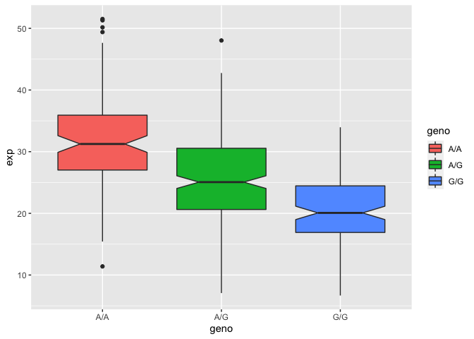

Class 11 HW
================
Marwa Mohammad Azim

\#Section 4: Population Scale Analysis

One sample is obviously not enough to know what is happening in a
population. You are interested in assessing genetic differences on a
population scale. So, you processed about \~230 samples and did the
normalization on a genome level. Now, you want to find whether there is
any association of the 4 asthma-associated SNPs (rs8067378…) on ORMDL3
expression.

How many samples do we have?

``` r
expr <- read.table("rs8067378_ENSG00000172057.6.txt")
head(expr)
```

       sample geno      exp
    1 HG00367  A/G 28.96038
    2 NA20768  A/G 20.24449
    3 HG00361  A/A 31.32628
    4 HG00135  A/A 34.11169
    5 NA18870  G/G 18.25141
    6 NA11993  A/A 32.89721

``` r
nrow(expr)
```

    [1] 462

``` r
table(expr$geno)
```


    A/A A/G G/G 
    108 233 121 

> Q13: Read this file into R and determine the sample size for each
> genotype and their corresponding median expression levels for each of
> these genotypes.

The sample size for each genotype is as follows: A/A 108 A/G 233 G/G 121

The corresponding median expression levels for each of these genotypes
are:

A/G 28.96038  
A/G 20.24449  
A/A 31.32628  
A/A 34.11169  
G/G 18.25141  
A/A 32.89721

``` r
library(ggplot2)
```

Lets make a boxplot

``` r
ggplot(expr) + aes(geno, exp, fill=geno) + 
  geom_boxplot(notch=TRUE)
```



> Q14: Generate a boxplot with a box per genotype, what could you infer
> from the relative expression value between A/A and G/G displayed in
> this plot? Does the SNP effect the expression of ORMDL3?

The relative expression value between A/A and G/G displayed in this plot
are very much different. Having G/G in this location is definitely
associated with having a reduced expression of the ORMDL3 gene.
